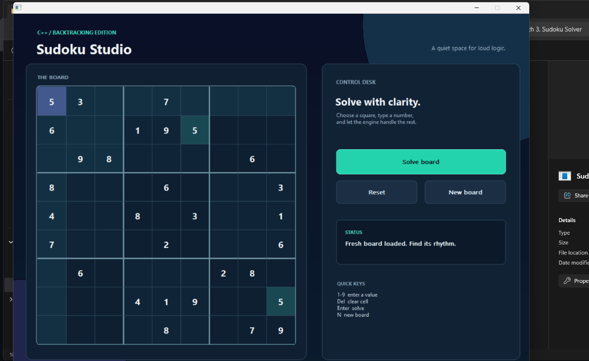
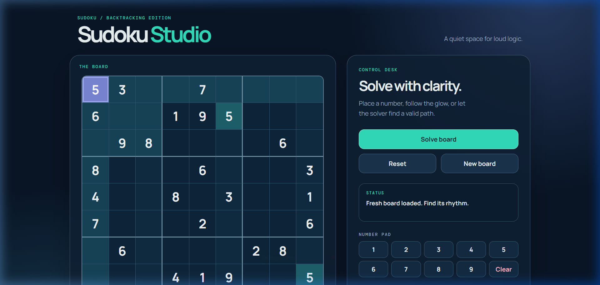

<div align="center">

# 🧩 Sudoku Studio

### **An Elegant C++ Desktop GUI & Responsive Web Application**
*Built with modern C++17, native Win32 API, and a clean, dark editorial aesthetic.*

---

[](#)
[](#)
[](https://codealpha-sudoku-solver.vercel.app/)
[](#)
[](#)

</div>

---

<div align="center" style="background-color: #0d1b2a; border: 2px solid #38e3c2; padding: 15px; border-radius: 12px; margin: 20px 0;">
  <h3>🌐 Play Now Online </h3>
  <p>Experience the fully interactive and responsive Sudoku Studio instantly in your web browser:</p>
  <a href="https://codealpha-sudoku-solver.vercel.app/" target="_blank" style="font-size: 1.25em; font-weight: bold; color: #38e3c2; text-decoration: none;">👉 https://codealpha-sudoku-solver.vercel.app/ 👈</a>
  <p style="font-size: 0.9em; color: #8892b0; margin-top: 10px;">*No installation, compile steps, or downloads required.*</p>
</div>

---

## 📋 Overview

> 💡 **Sudoku Studio** is an interactive Sudoku puzzle engine consisting of a high-performance **native Windows GUI** application and a **responsive web-based companion** deployed on Vercel. 
> 
> The desktop version uses dependency-free, hardware-accelerated Win32 graphics painted in a dark editorial theme. Under the hood, it features a smart **Backtracking Solver** enhanced by the **Minimum Remaining Values (MRV)** heuristic to find solutions in milliseconds.

This project was built as **Task 3** of the [CodeAlpha](https://www.codealpha.tech/) C++ internship program.

---

## 📸 Application Preview

<table width="100%">
  <tr>
    <td width="50%" align="center"><b>🖥️ Native C++ Desktop GUI</b></td>
    <td width="50%" align="center"><b>🌐 Responsive Web Edition</b></td>
  </tr>
  <tr>
    <td align="center">
      
    </td>
    <td align="center">
      
    </td>
  </tr>
</table>

---

## ✨ Features

*   **🖥️ Dependency-Free C++ GUI**
    *   Built purely with native Win32 APIs (no bulky frameworks like Qt or Electron).
    *   Ultra-low memory footprint (~2-3MB RAM) and zero startup delay.
*   **🎨 Premium Dark Editorial Theme**
    *   Dark navy and deep slate backdrops paired with neon cyan highlights.
    *   Interactive cells that softly glow and shift colors on hover, selection, or conflicts.
*   **⚡ Backtracking Solver with MRV**
    *   Employs a recursive backtracking engine powered by the **Minimum Remaining Values (MRV)** heuristic.
    *   Prioritizes cells with the fewest candidate choices to prune search branches early.
*   **🔍 Real-Time Conflict Highlighting**
    *   Instantly detects duplicate values in rows, columns, and 3x3 grids.
    *   Visually flags errors in deep red to assist players.
*   **🌐 Cross-Platform Web Companion**
    *   A beautifully matching, responsive web version optimized for mobile and desktop.
    *   Deploys statically to Vercel with zero runtime dependencies.

---

## 🚀 Build & Run

### 🌐 Option 1: Live Web Application
Play instantly online with no setup, configuration, or compilation steps. Optimize for mobile or desktop:
👉 **[codealpha-sudoku-solver.vercel.app](https://codealpha-sudoku-solver.vercel.app/)** 👈

---

### 📦 Option 2: Instant Desktop Launch (Windows)
Just download **`SudokuStudio.exe`** from the root of this repository and double-click to run. No setup or compilers needed!

---

### 🔨 Option 3: Build Desktop App from Source (CMake)
Ensure you have a C++17-compliant compiler and CMake 3.20+ installed.

```powershell
# 1. Configure the build
cmake -S project -B project/build

# 2. Build the executable
cmake --build project/build --config Release

# 3. Launch
.\project\build\Release\SudokuStudio.exe
```

---

### ⚡ Option 4: Compile Desktop App with MinGW Directly
Quick compiler build without configuring CMake:

```powershell
g++ -std=c++17 -mwindows project\src\main.cpp -lgdi32 -luser32 -o SudokuStudio.exe
.\SudokuStudio.exe
```

---

### 💻 Option 5: Local Web Run
Open [`project/web/index.html`](project/web/index.html) directly in any web browser to run the companion site offline.

---

## 🗂️ Project Structure

```
CodeAlpha_Sudoku-Solver/
├── SudokuStudio.exe      # Precompiled desktop app
├── LICENSE               # MIT License
├── README.md             # Documentation (Aesthetics edition)
├── vercel.json           # Vercel routing configuration
├── assets/               # Visual media
│   ├── desktop_preview.png
│   └── web_preview.png
└── project/              # Source code files
    ├── CMakeLists.txt    # C++ build system file
    ├── src/
    │   └── main.cpp      # Desktop GUI & backtracking solver
    └── web/              # Web application
        ├── index.html
        ├── styles.css
        └── app.js
```

---

## 🧮 Solver Mechanics

The solver treats Sudoku as a **Constraint Satisfaction Problem (CSP)** and solves it recursively using backtracking:

```
[Start Solver] ──> [Find empty cell with MINIMUM candidate choices (MRV)]
                         │
                         ├──> [None found?] ──> [Solve complete! 🎉]
                         │
                         └──> [Try valid candidates 1-9 sequentially]
                                   │
                                   ├──> [Valid?] ──> [Recurse solver]
                                   │                      │
                                   │                      └──> [Fails later?] ──> [Backtrack & try next]
                                   │
                                   └──> [All choices failed?] ──> [Trigger backtrack ↩]
```

1. **Minimum Remaining Values (MRV)**: Instead of choosing the next cell sequentially, the algorithm picks the cell with the fewest valid possibilities left. This drastically cuts down the search space.
2. **Backtracking**: When the solver makes a choice that leads to an unsolvable state downstream, it steps back, resets the cell, and tries the next candidate digit.

---

## 🎮 Controls & Interface

| Action | Control (Desktop) | Interaction (Web) |
| :--- | :--- | :--- |
| **Select Cell** | Arrow Keys `↑ ↓ ← →` or Mouse Click | Mouse Click or Tap |
| **Input Number** | Numpad / Keyboard keys `1`–`9` | Tap a cell, then select from UI numbers |
| **Clear Cell** | `Backspace`, `Delete`, or `0` | Tap clear or input `0` |
| **Solve Board** | Press `Enter` or click **"Solve board"** | Click **"Solve board"** button |
| **New Board** | Press `N` or click **"New board"** | Click **"New board"** button |
| **Reset Board** | Press `R` or click **"Reset"** | Click **"Reset"** button |

---

## 📄 License

Released under the [MIT License](LICENSE).
